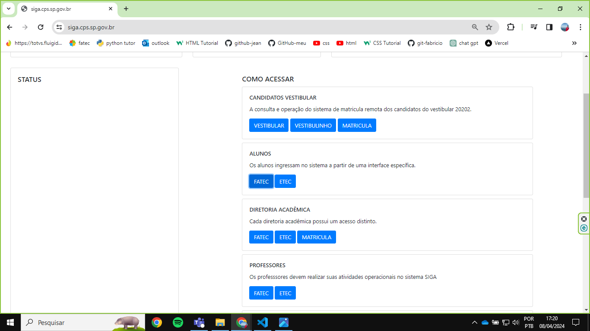
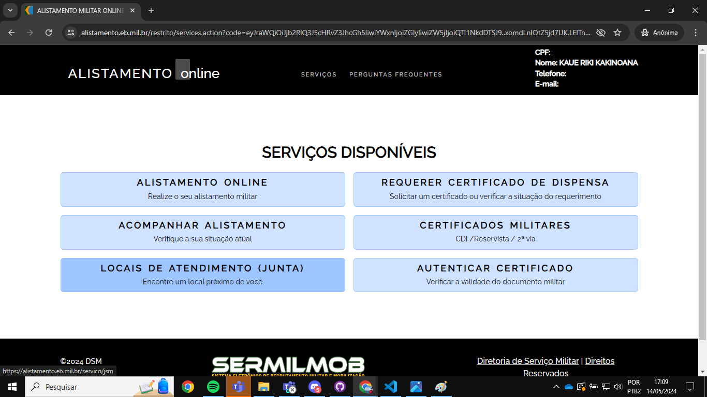
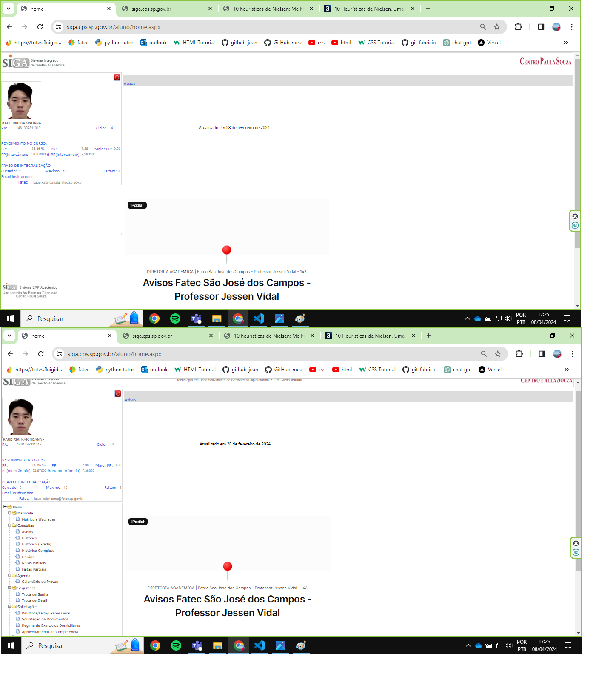
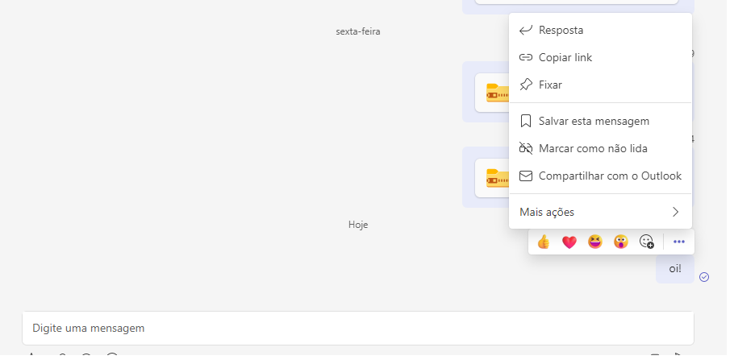

<h1 align="center"> Trabalho das heurísticas da matéria de Interação Humano Computador do professor Bertoti</h1>

<h2 align="center">Heurística 1(Visibilidade do Status do sistema)</h2>

Falta da visibilidade do status, entrando na heurística 1

<h2 align="center">Heurística 4(Consistência e padronização)<h2>

Após o login feito não há nenhum botão de logout, entrando na heurística 4. 

<h2 align="center">Heurística 4(segundo exemplo)</h2>

Falta da padronuzação da barra lateral, onde em uma tela não possui nada na barra lateral e outra tela há várias opções, entrando na heurística 4.

<h2 align="center">Heurística 5(Prevenção de erros)</h2>

Depois que é enviada uma mensagem não é possível editar nem apagá-la, entrando na heurística 5.
